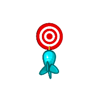

## Hi there I am Mr.Rezoo
### Reach me on : 

---

###   More About Me:

-  I’m currently working on ... Django
-   I’m currently learning ...  Datamining - machine learning
-  I’m looking to collaborate on ... Best Developers :)
-  I’m looking for help with ... 
-  Ask me about ... Anything
-  How to reach me: ... [Telegram => Mr_Rezoo](https://t.me/MR_Rezoo)
-  Pronouns: ... Motivated
-  Fun fact: ... Life may be hard, but you had the best of it from the beginning

---

[comment]: <> (
)

[comment]: <> ()

  
### 🔨 Languages :

### 🚀 Frameworks :

### 🛸 Third-Frameworks :

### ⚙️ Tools :

### ⚡ Database :

### 👨🏻‍💻 Workspace

###   My GitHub Stats

<!--START_SECTION:waka-->

<!--END_SECTION:waka-->
