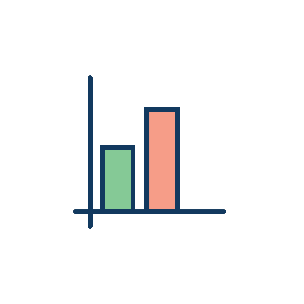
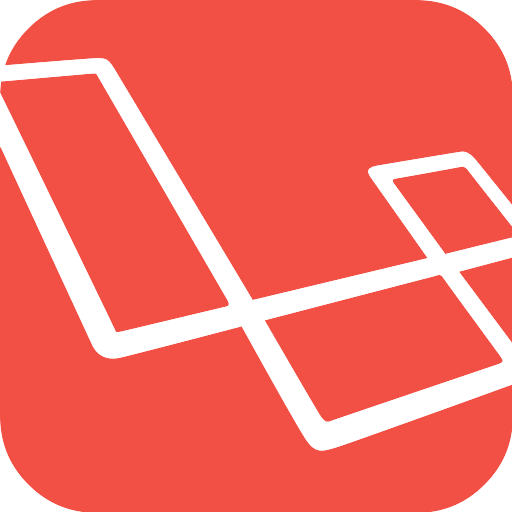

## Hi there I am Mr.Rezoo ( Reza Mobaraki )

### Reach me on : 

<a href="https://www.linkedin.com/in/reza-mobaraki/">
  
</a>
<a href="https://www.instagram.com/mr.rezoo/">
  
</a>
<a href="https://t.me/MR_Rezoo">
  
</a>
<a href="https://twitter.com/Mr_Rezoo">
  
</a>
<a href="https://gitlab.com/Mr.Rezoo">
  
</a>

<br/>

---

###   More About Me:

-  I’m currently working on ... Development of my technical skills
- 🌱 I’m currently learning ... Python
- 👯 I’m looking to collaborate on ... Best Developers :)
-  I’m looking for help with ... 
- 💬 Ask me about ... Anything
-  How to reach me: ... [Telegram => Mr_Rezoo](https://t.me/MR_Rezoo)
-  Pronouns: ... Motivated
-  Fun fact: ... Life may be hard, but you had the best of it from the beginning

---


[comment]: <> (<p align="center">)

[comment]: <> ()

###   My GitHub Stats

<!--START_SECTION:waka-->


**🐱 My Github Data** 

> 🏆 209 Contributions in the Year 2021
 > 
> 📦 321.4 kB Used in Github's Storage 
 > 
> 🚫 Not Opted to Hire
 > 
> 📜 17 Public Repositories 
 > 
> 🔑 2 Private Repositories  
 > 
**I'm an Early 🐤** 

```text
🌞 Morning    1 commits      ░░░░░░░░░░░░░░░░░░░░░░░░░   1.12% 
🌆 Daytime    44 commits     ████████████░░░░░░░░░░░░░   49.44% 
🌃 Evening    34 commits     █████████░░░░░░░░░░░░░░░░   38.2% 
🌙 Night      10 commits     ██░░░░░░░░░░░░░░░░░░░░░░░   11.24%

```
📅 **I'm Most Productive on Sunday** 

```text
Monday       15 commits     ████░░░░░░░░░░░░░░░░░░░░░   16.85% 
Tuesday      4 commits      █░░░░░░░░░░░░░░░░░░░░░░░░   4.49% 
Wednesday    18 commits     █████░░░░░░░░░░░░░░░░░░░░   20.22% 
Thursday     6 commits      █░░░░░░░░░░░░░░░░░░░░░░░░   6.74% 
Friday       11 commits     ███░░░░░░░░░░░░░░░░░░░░░░   12.36% 
Saturday     4 commits      █░░░░░░░░░░░░░░░░░░░░░░░░   4.49% 
Sunday       31 commits     ████████░░░░░░░░░░░░░░░░░   34.83%

```


📊 **This Week I Spent My Time On** 

```text
⌚︎ Time Zone: Asia/Tehran

💬 Programming Languages: 
Other                    17 hrs 41 mins      █████████████████████░░░░   83.58% 
Python                   3 hrs 8 mins        ███░░░░░░░░░░░░░░░░░░░░░░   14.83% 
SQL                      11 mins             ░░░░░░░░░░░░░░░░░░░░░░░░░   0.87% 
JSON                     8 mins              ░░░░░░░░░░░░░░░░░░░░░░░░░   0.66% 
Git Config               0 secs              ░░░░░░░░░░░░░░░░░░░░░░░░░   0.03%

🔥 Editors: 
Browser                  17 hrs 4 mins       ████████████████████░░░░░   80.64% 
PyCharm                  4 hrs 5 mins        ████░░░░░░░░░░░░░░░░░░░░░   19.36% 
PhpStorm                 0 secs              ░░░░░░░░░░░░░░░░░░░░░░░░░   0.0%

🐱‍💻 Projects: 
crawling                 8 hrs 34 mins       ██████████░░░░░░░░░░░░░░░   40.54% 
src2                     4 hrs 43 mins       █████░░░░░░░░░░░░░░░░░░░░   22.34% 
mobaraki-ostovar.php     3 hrs 1 min         ███░░░░░░░░░░░░░░░░░░░░░░   14.28% 
practical-web-scrapping-f2 hrs 54 mins       ███░░░░░░░░░░░░░░░░░░░░░░   13.71% 
statsBasic               1 hr 8 mins         █░░░░░░░░░░░░░░░░░░░░░░░░   5.38%

💻 Operating System: 
Mac                      21 hrs 10 mins      █████████████████████████   100.0%

```

**I Mostly Code in Python** 

```text
Python                   7 repos             █████████████░░░░░░░░░░░░   53.85% 
PHP                      6 repos             ███████████░░░░░░░░░░░░░░   46.15%

```


**Timeline**

 


<!--END_SECTION:waka-->

---
  
### 🔨 Languages and Tools:
<p align="center">
<a href="https://www.python.org" target="_blank"></a>
<a href="https://www.laravel.com" target="_blank"></a>
<a href="https://git-scm.com" target="_blank"></a>
<a href="https://www.linux.org" target="_blank"></a>

